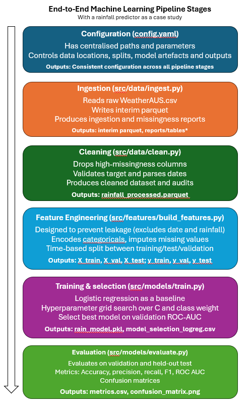
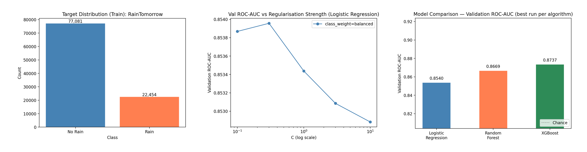
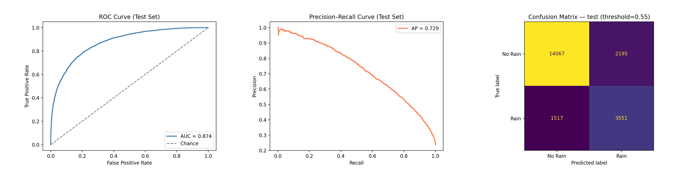
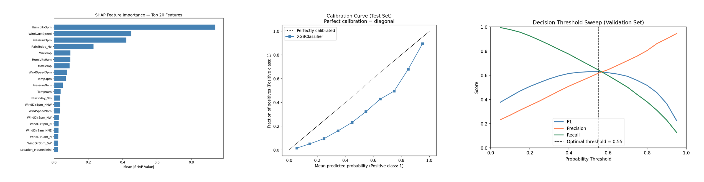

# Full Stack ML Pipeline (Australian Rainfall Prediction)


This repository contains a reproducible end-to-end machine learning pipeline to predict whether it will rain tomorrow using the Australian Weather data. The pipeline is full-stack, covering data ingestion, cleaning, feature engineering, time-aware splitting, hyperparameter grid search across multiple algorithms, final evaluation, SHAP explainability, and an interactive Streamlit prediction app.

The aim of this project was to build the pipeline manually, without relying on AutoML, to develop a genuine understanding of each component and sharpen data engineering skills. All configuration is externalised, every stage is tested, and the full pipeline is reproducible in a single command.

The data source is the Australian Weather Dataset (WeatherAUS from Kaggle). Target variable: `RainTomorrow` (Yes/No binary classification).

---

## Table of Contents
- [Overview](#overview)
- [Quick Start](#quick-start)
- [Technical Workflow](#technical-workflow)
  - [Configuration](#configuration)
  - [Ingestion](#ingestion)
  - [Cleaning](#cleaning)
  - [Feature Engineering](#feature-engineering)
    - [Splitting the dataset](#splitting-the-dataset)
  - [Modelling and Selection](#modelling-and-selection)
    - [Experiment log](#experiment-log)
    - [Model comparison](#model-comparison)
  - [Evaluation](#evaluation)
    - [Threshold optimisation](#threshold-optimisation)
    - [Confusion matrices](#confusion-matrices)
  - [Explainability](#explainability)
  - [Streamlit App](#streamlit-app)
- [Summary](#summary)
  - [Summary of model](#summary-of-model)
    - [Limitations of model](#limitations-of-model)
  - [Summary of machine learning pipeline](#summary-of-machine-learning-pipeline)
    - [Limitations of machine learning pipeline](#limitations-of-machine-learning-pipeline)
- [Tests](#tests)
- [Appendices](#appendices)
  - [Metadata](#metadata)
  - [File directory](#file-directory)
  - [Commands](#commands)

---

## Overview
The pipeline transforms raw weather records through preprocessing, feature construction, and data partitioning. Models are trained and compared using validation-based selection with optional TimeSeriesSplit cross-validation, with final performance assessed on a fully held-out test set and supported by diagnostic metrics and visual analyses.



---

## Quick Start

```bash
# 1. Install dependencies
pip install -r requirements.txt

# 2. Run the full pipeline end-to-end
make all

# 3. Launch the interactive prediction app
make app

# Run tests
make test
```

Or run pipeline stages individually — see [Commands](#commands).

---

## Technical Workflow

---

### Configuration
All parameters are centralised in `asset/config.yaml`, including file paths, split ratios, random seed, and the full hyperparameter grids for every model. This removes all hardcoded values from the scripts, ensuring the pipeline can be re-run on different machines without code changes, and all experimental decisions are auditable and version-controlled.

New in this version: the `training` section of the config defines separate grids for each algorithm, and `evaluation.cv_folds` controls whether TimeSeriesSplit cross-validation is applied during model selection.

---

### Ingestion
Raw data is ingested from CSV and stored in `weatherAUS_interim.parquet`. Parquet is used throughout because it is columnar (more efficient for the feature-selection and encoding steps typical in ML pipelines) and compressed, which is important at 145k rows.

After ingestion, two audit artefacts are generated: an ingestion report (row count, duplicates, date range) and a missingness report showing the fraction of missing values per column.

---

#### Ingestion report
The ingestion report confirms 145,460 rows, 23 columns, 0 duplicates, and a date range of 01/11/2007 to 25/06/2017. Since one column is a date, splitting must be chronological to avoid leakage — described in [Splitting the dataset](#splitting-the-dataset).

---

### Cleaning
The pipeline applies the following auditable cleaning rules to `weatherAUS_interim.parquet`:

At the column level, any variable with missingness above 38% — `Sunshine`, `Evaporation`, `Cloud3pm`, `Cloud9am` — is removed, as they would reduce the quality of engineered features and affect model performance.

At the row level, records with a missing target (`RainTomorrow`) are dropped, ensuring all training observations have observed outcomes.

The cleaned dataset is saved as `rainfall_processed.parquet`.

---

### Feature Engineering
Feature engineering transforms the cleaned dataset into model-ready inputs while preventing data leakage. Variables that are likely collinear with the target, `Rainfall` and `RainToday`, are removed (since the model is predicting rainfall from weather conditions, not from prior rainfall records). Non-predictive fields (`Date`) are also excluded.

Categorical variables are encoded via OneHotEncoding, and missing values are imputed using reproducible strategies (median for numeric, most-frequent for categorical). Critically, the preprocessor is fitted on the training split only and applied to val/test, preventing any information from future observations influencing the transformations.

The fitted preprocessor is saved to `models/preprocessor.pkl` for use by the Streamlit app at inference time.

---

#### Splitting the dataset
The dataset is partitioned using a chronological split based on the observation date. Records are sorted in ascending order by `Date` to preserve the natural temporal sequence of weather observations. This approximates a rolling-forecast scenario: the model trains on the first 70% of observations, is tuned on the next 15%, and is evaluated on the most recent and fully unseen final 15%.

| Split      | Rows   | Date Range                    |
|------------|--------|-------------------------------|
| Train      | 99,535 | 2007-11-01 → 2015-01-12       |
| Validation | 21,328 | 2015-01-12 → 2016-04-08       |
| Test       | 21,330 | 2016-04-08 → 2017-06-25       |

Splits are saved as separate Parquet files: `X_train.parquet`, `X_val.parquet`, `X_test.parquet`, `y_train.parquet`, `y_val.parquet`, `y_test.parquet`.

---

## Modelling and Selection
Three algorithms are trained and compared. Hyperparameter grids for each are defined in `config.yaml` (no hardcoded values in the training scripts). Each candidate model is trained on the training split and scored on the temporally separated validation set to prevent leakage. An optional `cv_folds` setting enables TimeSeriesSplit cross-validation on the training data for more robust estimates.

Model selection is based primarily on validation ROC-AUC, reflecting the model's ability to discriminate between rainy and non-rainy days independently of the decision threshold. Ties are broken using F1, Precision, Recall, and Accuracy, in that order.

**Algorithms:**

| Algorithm           | Grid size | Notes                                               |
|---------------------|-----------|-----------------------------------------------------|
| Logistic Regression | 10 runs   | L2 regularisation; interpretable baseline           |
| Random Forest       | 4 runs    | Ensemble; handles non-linearity                     |
| XGBoost             | 4 runs    | Gradient boosting; `scale_pos_weight` for imbalance |

---

### Experiment log (Logistic Regression)

| run | C    | class_weight | roc_auc | accuracy | precision | recall | f1    |
|-----|------|--------------|---------|----------|-----------|--------|-------|
| 10  | 10   | balanced     | 0.855   | 0.801    | 0.508     | 0.727  | 0.598 |
| 8   | 3    | balanced     | 0.855   | 0.801    | 0.508     | 0.727  | 0.598 |
| 6   | 1    | balanced     | 0.855   | 0.801    | 0.508     | 0.727  | 0.598 |
| 4   | 0.3  | balanced     | 0.855   | 0.801    | 0.508     | 0.727  | 0.598 |
| 2   | 0.1  | balanced     | 0.855   | 0.801    | 0.508     | 0.727  | 0.598 |
| 9   | 10   |              | 0.854   | 0.852    | 0.722     | 0.449  | 0.554 |
| 7   | 3    |              | 0.854   | 0.852    | 0.722     | 0.449  | 0.554 |
| 5   | 1    |              | 0.854   | 0.852    | 0.723     | 0.449  | 0.554 |
| 3   | 0.3  |              | 0.854   | 0.852    | 0.723     | 0.449  | 0.554 |
| 1   | 0.1  |              | 0.854   | 0.852    | 0.723     | 0.449  | 0.554 |

Full logs for all algorithms are saved to `reports/tables/model_selection_{algo}.csv`.

---

### Model comparison

The best model from each algorithm is compared side-by-side in `reports/tables/model_comparison.csv`. The chart below shows validation ROC-AUC alongside class distribution and the regularisation sweep for logistic regression. The overall best model is selected and saved to `models/rain_model.pkl`.



The training set is class-imbalanced at roughly 78% No Rain / 22% Rain. XGBoost achieves the highest ROC-AUC (0.874) on the validation set, followed closely by Random Forest (0.867) and Logistic Regression (0.855). All three algorithms benefit from class-weighting or `scale_pos_weight`, which corrects for the imbalance during training.

---

## Evaluation
The pipeline evaluates the best model on both the validation and held-out test sets, recording metrics in `metrics.csv` and generating diagnostic artefacts for detailed error analysis. Evaluation outputs are intentionally multi-modal, combining tabular metrics with visual tools that characterise decision behaviour across thresholds.

| Metric     | Validation | Test  |
|------------|------------|-------|
| Accuracy   | 0.801      | 0.775 |
| Precision  | 0.508      | 0.519 |
| Recall     | 0.727      | 0.755 |
| F1-Score   | 0.598      | 0.615 |
| ROC AUC    | 0.855      | 0.849 |



The ROC-AUC of 0.849 on the held-out test set confirms the model generalises well to unseen data. The Precision-Recall curve (AP = 0.629) shows meaningful lift over a random baseline despite the class imbalance. The confusion matrix reflects the model's high-recall operating point — it catches most rainy days at the cost of some false alarms, which is the preferred trade-off for a weather alert use case.

---

### Threshold optimisation
The default decision threshold of 0.5 is not always optimal for imbalanced classification. The pipeline sweeps probability thresholds from 0.05 to 0.95 on the validation set and selects the threshold that maximises F1-score (with recall as a tiebreaker, since missing a rainy day is typically a worse error than a false alarm). Results are saved to `reports/tables/threshold_sweep.csv`.

---

## Explainability

SHAP (SHapley Additive exPlanations) values are computed on the test set and used to produce a feature importance summary. This shows which weather variables drive the model's predictions most strongly, and in which direction — moving beyond accuracy numbers to explain the model's decision logic. The calibration (reliability) diagram compares predicted probabilities against observed frequencies; a well-calibrated model follows the diagonal, meaning a predicted 70% probability corresponds to rain actually occurring ~70% of the time.



Humidity at 3pm is the single strongest predictor — high afternoon humidity sharply increases rain probability. Wind gust speed and afternoon temperature also contribute meaningfully. The calibration curve sits close to the diagonal across the mid-range, with some overconfidence at high predicted probabilities. The threshold sweep confirms the optimal operating point is below 0.5, consistent with the class imbalance and the preference for recall over precision.

---

## Streamlit App
An interactive prediction app is included in `app.py`. It loads the trained model and saved preprocessor, accepts raw weather inputs (the same 16 features used during training), and returns a predicted probability with a binary rain/no-rain decision.

```bash
streamlit run app.py
# or:  make app
```

The app displays model metadata in the sidebar and applies the same optimal decision threshold selected during evaluation.

---

## Summary
The evaluation artefacts show the model achieves strong class separation, with ROC-AUC values near 0.85 indicating reliable ranking between rainy and non-rainy days. Decision behaviour prioritises sensitivity to rainfall events, capturing most positive cases while accepting a moderate level of false positives. Performance remains consistent across validation and held-out test splits, supporting the stability of the modelling approach under time-aware partitioning.

---

### Summary of model
The final model is a regularised classifier trained on a high-dimensional feature set derived from cleaned and encoded meteorological variables. It produces calibrated probability estimates and supports transparent analysis of feature effects via SHAP. Model selection was conducted across three algorithms using validation-based hyperparameter tuning, with experiment results logged per-algorithm to enable reproducibility and auditability. Evaluation outputs include confusion matrices, threshold-agnostic curves, and a probability calibration chart, providing insight into classification behaviour across operating points.

---

### Limitations of model
The model was trained on a single Australian weather dataset spanning 2007–2017 and may not generalise well to other geographic regions, climate systems, or time periods where weather patterns differ materially. The class imbalance (~22% rainy days) is addressed through class weighting and threshold tuning, but some false-positive rate remains. Features with high missingness (Sunshine, Evaporation, Cloud cover) were dropped rather than imputed, which discards potentially predictive signal.

---

## Summary of machine learning pipeline
The pipeline provides a complete workflow from raw data ingestion through cleaning, feature construction, multi-model training, and evaluation. Each stage produces persistent artefacts, enabling traceability across data transformations, experimental runs, and final outputs. Configuration is externalised, allowing consistent execution across environments while maintaining reproducibility. Automated reporting ensures quantitative metrics and visual diagnostics are generated systematically, supporting transparent model assessment and iterative development.

---

### Limitations of machine learning pipeline
The pipeline currently uses a single chronological holdout for validation rather than a rolling time-series cross-validation strategy, which means hyperparameter selection is based on a single window of data and may not generalise to all time periods equally. The preprocessing pipeline (imputation, encoding) is fitted on the training split, which is correct, but the imputation values are fixed at training time and could drift from the population over time in a live deployment. There is no model versioning or experiment tracking (e.g., MLflow) beyond the CSV logs, which would be important in a multi-team production environment.

---

## Tests

Unit tests cover the key logic of the cleaning, feature engineering, and training modules without requiring the full dataset.

```bash
# Run all tests
make test
# or:  pytest tests/ -v
```

Tests are organised as follows: `tests/test_clean.py` validates the cleaning rules (column dropping, row removal, schema), `tests/test_features.py` validates the chronological split logic (ordering, no overlap, full coverage), and `tests/test_train.py` validates label coercion, metric computation, and threshold sweeping.

The CI pipeline (`.github/workflows/ci.yml`) runs linting and tests on every push and pull request against Python 3.10 and 3.11.

---

## Appendices
### Metadata
| Column        | Unit               | Description                                                         |
|---------------|--------------------|---------------------------------------------------------------------|
| Date          | YYYY-MM-DD         | The date of observation.                                            |
| Location      | [string]           | The common name of the location of the weather station.             |
| MinTemp       | Celsius            | The minimum temperature.                                            |
| MaxTemp       | Celsius            | The maximum temperature.                                            |
| Rainfall      | mm                 | The amount of rainfall recorded for the day.                        |
| Evaporation   | mm                 | Class A pan evaporation in 24 hours prior to 9am.                   |
| Sunshine      | hours              | Length of time of bright sunshine in the day.                       |
| WindGustDir   | Cardinal direction | Direction of strongest wind gust in 24 hours prior to midnight.     |
| WindGustSpeed | km/h               | Speed of the strongest wind gust in the 24 hours prior to midnight. |
| WindDir9am    | Cardinal direction | Direction of the wind at 9am.                                       |
| RainToday     | Yes/No             | Whether or not it had rained today.                                 |
| RainTomorrow  | Yes/No             | The target variable. Will it rain the next day?                     |

---

### Missingness report (before cleaning)

| column        | missing_fraction |
|---------------|------------------|
| Sunshine      | 0.48             |
| Evaporation   | 0.43             |
| Cloud3pm      | 0.41             |
| Cloud9am      | 0.38             |
| Pressure9am   | 0.10             |
| Pressure3pm   | 0.10             |
| WindDir9am    | 0.07             |
| WindGustDir   | 0.07             |
| WindGustSpeed | 0.07             |
| Humidity3pm   | 0.03             |
| WindDir3pm    | 0.03             |
| Temp3pm       | 0.02             |
| RainTomorrow  | 0.02             |
| Rainfall      | 0.02             |
| RainToday     | 0.02             |
| WindSpeed3pm  | 0.02             |
| Humidity9am   | 0.02             |
| WindSpeed9am  | 0.01             |
| Temp9am       | 0.01             |
| MinTemp       | 0.01             |
| MaxTemp       | 0.01             |
| Date          | 0                |
| Location      | 0                |

---

### File directory
```
full-stack-ml-pipeline/
│
├── requirements.txt         # Pinned dependencies
├── Makefile                 # One-command pipeline orchestration
├── app.py                   # Streamlit prediction app
├── conftest.py              # pytest path configuration
│
├── .github/
│   └── workflows/
│       └── ci.yml           # GitHub Actions: lint + test on push/PR
│
├── tests/
│   ├── test_clean.py        # Unit tests: cleaning rules
│   ├── test_features.py     # Unit tests: time-split logic
│   └── test_train.py        # Unit tests: label coercion, metrics, threshold sweep
│
└── asset/
    ├── config.yaml          # All parameters, paths, and model grids
    │
    ├── data/
    │   ├── raw/             # Original dataset (CSV)
    │   ├── interim/         # Post-ingestion (Parquet)
    │   └── processed/       # Cleaned data + model-ready features (Parquet)
    │
    ├── models/
    │   ├── rain_model.pkl       # Best trained model bundle
    │   └── preprocessor.pkl    # Fitted preprocessor (for inference)
    │
    ├── src/
    │   ├── utils/           # Config loading
    │   ├── data/            # ingest.py, clean.py
    │   ├── features/        # build_features.py
    │   ├── models/          # train.py, evaluate.py
    │   └── reports/         # make_figures.py, make_dashboard.py
    │
    ├── notebooks/
    │   ├── 01_eda.ipynb
    │   └── 02_results.ipynb
    │
    └── reports/
        ├── tables/          # Metrics, logs, threshold sweep, model comparison
        └── figures/         # All diagnostic plots + dashboards
```

---

### Commands

All pipeline stages can be run via `make` from the repository root:

```bash
make all        # Full pipeline end-to-end
make ingest     # CSV -> interim Parquet + audit reports
make clean      # Interim -> cleaned dataset
make features   # Cleaned -> train/val/test splits + encoding + preprocessor
make train      # Train all models via hyperparameter grid search
make evaluate   # Evaluate best model + optimise decision threshold
make figures    # Generate all diagnostic plots
make dashboard  # Compile figures into strip dashboards
make test       # Run pytest unit tests
make lint       # Run flake8 linter
make app        # Launch Streamlit prediction app
```

Or run individual scripts directly from the `asset/` directory:

```bash
cd asset
python -m src.data.ingest
python -m src.data.clean
python -m src.features.build_features
python -m src.models.train
python -m src.models.evaluate
python -m src.reports.make_figures
python -m src.reports.make_dashboard
```
