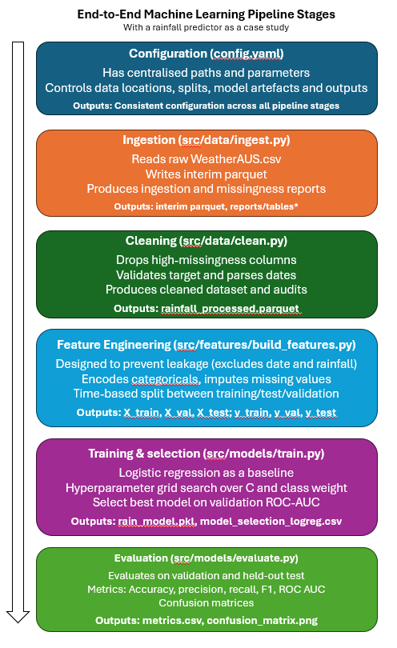
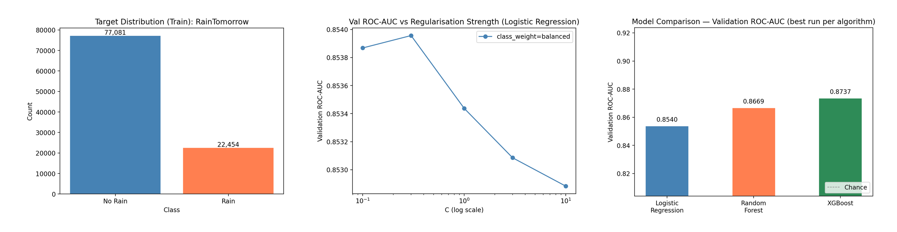
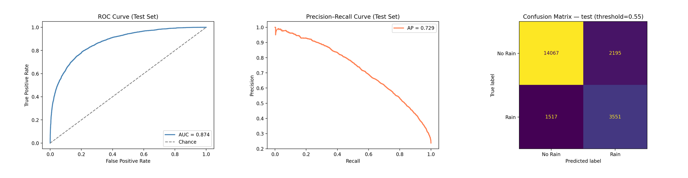
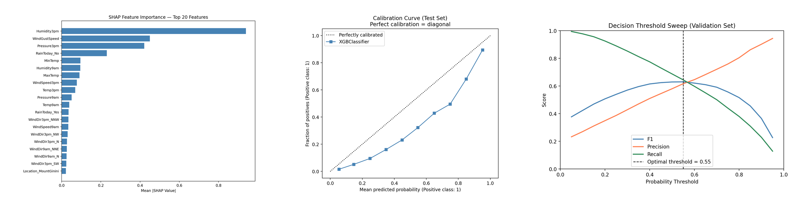

# Full Stack ML Pipeline (Australian Rainfall Prediction)


A reproducible end-to-end machine learning pipeline predicting whether it will rain tomorrow in Australia, covering data ingestion, cleaning, feature engineering, time-aware splitting, hyperparameter search across three algorithms, threshold optimisation, SHAP explainability, and an interactive Streamlit prediction app.

The pipeline is built manually rather than with AutoML, to develop a working understanding of each component. All configuration is externalised to a single YAML file, the core stages are unit tested (33 tests, run in CI), and the full pipeline is reproducible with one command.

**Result:** XGBoost achieves ROC-AUC 0.874 on a fully held-out, temporally separated test set, with an F1 of 0.66 at the optimised decision threshold.

**Data:** Australian Weather Dataset (weatherAUS, Kaggle), 145k daily observations from 2007–2017. Target: `RainTomorrow` (Yes/No).

---

## Table of Contents
- [Overview](#overview)
- [Quick Start](#quick-start)
- [Technical Workflow](#technical-workflow)
  - [Configuration](#configuration)
  - [Ingestion](#ingestion)
  - [Cleaning](#cleaning)
  - [Feature Engineering](#feature-engineering)
    - [Splitting the dataset](#splitting-the-dataset)
  - [Modelling and Selection](#modelling-and-selection)
    - [Experiment log](#experiment-log)
    - [Model comparison](#model-comparison)
  - [Evaluation](#evaluation)
    - [Threshold optimisation](#threshold-optimisation)
  - [Explainability](#explainability)
  - [Streamlit App](#streamlit-app)
- [Summary](#summary)
  - [Limitations](#limitations)
- [Tests](#tests)
- [Appendices](#appendices)
  - [Metadata](#metadata)
  - [File directory](#file-directory)
  - [Commands](#commands)

---

## Overview
The pipeline transforms raw weather records through preprocessing, feature construction, and data partitioning. Models are trained and compared using validation-based selection with optional TimeSeriesSplit cross-validation, with final performance assessed on a fully held-out test set and supported by diagnostic metrics and visual analyses.



---

## Quick Start

```bash
# 0. Download weatherAUS.csv from Kaggle and place it in asset/data/raw/

# 1. Install dependencies (Python 3.10 or 3.11)
pip install -r requirements.txt

# 2. Run the full pipeline end-to-end
make all

# 3. Launch the interactive prediction app
make app

# Run tests
make test
```

Or run pipeline stages individually — see [Commands](#commands).

---

## Technical Workflow

---

### Configuration
All parameters are centralised in `asset/config.yaml`: file paths, split ratios, random seed, per-algorithm hyperparameter grids, and evaluation settings (including `evaluation.cv_folds`, which enables TimeSeriesSplit cross-validation during model selection). No values are hardcoded in the scripts, so the pipeline can be re-run on different machines without code changes and every experimental decision is auditable and version-controlled.

---

### Ingestion
Raw data is ingested from CSV and stored in `weatherAUS_interim.parquet`. Parquet is used throughout because it is columnar (more efficient for the feature-selection and encoding steps typical in ML pipelines) and compressed, which is important at 145k rows.

After ingestion, two audit artefacts are generated: an ingestion report (row count, duplicates, date range) and a missingness report showing the fraction of missing values per column.

---

#### Ingestion report
The ingestion report confirms 145,460 rows, 23 columns, 0 duplicates, and a date range of 01/11/2007 to 25/06/2017. Since one column is a date, splitting must be chronological to avoid leakage — described in [Splitting the dataset](#splitting-the-dataset).

---

### Cleaning
The pipeline applies the following auditable cleaning rules to `weatherAUS_interim.parquet`:

At the column level, any variable with missingness above 38% — `Sunshine`, `Evaporation`, `Cloud3pm`, `Cloud9am` — is removed, as they would reduce the quality of engineered features and affect model performance.

At the row level, records with a missing target (`RainTomorrow`) are dropped, ensuring all training observations have observed outcomes.

The cleaned dataset is saved as `rainfall_processed.parquet`.

---

### Feature Engineering
Feature engineering transforms the cleaned dataset into model-ready inputs while preventing data leakage. Variables that are likely collinear with the target, `Rainfall` and `RainToday`, are removed (since the model is predicting rainfall from weather conditions, not from prior rainfall records). Non-predictive fields (`Date`) are also excluded.

Categorical variables are encoded via OneHotEncoding, and missing values are imputed using reproducible strategies (median for numeric, most-frequent for categorical). Critically, the preprocessor is fitted on the training split only and applied to val/test, preventing any information from future observations influencing the transformations.

The fitted preprocessor is saved to `models/preprocessor.pkl` for use by the Streamlit app at inference time.

---

#### Splitting the dataset
The dataset is partitioned using a chronological split based on the observation date. Records are sorted in ascending order by `Date` to preserve the natural temporal sequence of weather observations. This approximates a rolling-forecast scenario: the model trains on the first 70% of observations, is tuned on the next 15%, and is evaluated on the most recent and fully unseen final 15%.

| Split      | Rows   | Date Range                    |
|------------|--------|-------------------------------|
| Train      | 99,535 | 2007-11-01 → 2015-01-12       |
| Validation | 21,328 | 2015-01-12 → 2016-04-08       |
| Test       | 21,330 | 2016-04-08 → 2017-06-25       |

Splits are saved as separate Parquet files: `X_train.parquet`, `X_val.parquet`, `X_test.parquet`, `y_train.parquet`, `y_val.parquet`, `y_test.parquet`.

---

## Modelling and Selection
Three algorithms are trained and compared. Hyperparameter grids for each are defined in `config.yaml` (no hardcoded values in the training scripts). Each candidate model is trained on the training split and scored on the temporally separated validation set to prevent leakage. An optional `cv_folds` setting enables TimeSeriesSplit cross-validation on the training data for more robust estimates.

Model selection is based primarily on validation ROC-AUC, reflecting the model's ability to discriminate between rainy and non-rainy days independently of the decision threshold. Ties are broken using F1, Precision, Recall, and Accuracy, in that order.

**Algorithms:**

| Algorithm           | Grid size | Notes                                               |
|---------------------|-----------|-----------------------------------------------------|
| Logistic Regression | 10 runs   | L2 regularisation; interpretable baseline           |
| Random Forest       | 4 runs    | Ensemble; handles non-linearity                     |
| XGBoost             | 4 runs    | Gradient boosting; `scale_pos_weight` for imbalance |

---

### Experiment log (Logistic Regression, top runs)

| run | C    | class_weight | roc_auc | accuracy | precision | recall | f1    |
|-----|------|--------------|---------|----------|-----------|--------|-------|
| 4   | 0.3  | balanced     | 0.854   | 0.799    | 0.505     | 0.723  | 0.594 |
| 5   | 1    |              | 0.854   | 0.852    | 0.723     | 0.449  | 0.554 |

The regularisation sweep is flat — validation ROC-AUC is insensitive to C across two orders of magnitude, while `class_weight="balanced"` trades precision for recall as expected. Full logs for all algorithms are saved to `reports/tables/model_selection_{algo}.csv`.

---

### Model comparison

The best model from each algorithm is compared side-by-side in `reports/tables/model_comparison.csv`. The chart below shows validation ROC-AUC alongside class distribution and the regularisation sweep for logistic regression. The overall best model is selected and saved to `models/rain_model.pkl`.



The training set is class-imbalanced at roughly 78% No Rain / 22% Rain. XGBoost achieves the highest validation ROC-AUC (0.874), followed by Random Forest (0.867) and Logistic Regression (0.854). All three algorithms benefit from class-weighting or `scale_pos_weight`, which corrects for the imbalance during training. **The selected final model is XGBoost** (100 trees, max_depth 6, learning_rate 0.1, scale_pos_weight 3), saved to `models/rain_model.pkl`.

---

## Evaluation
The best model (XGBoost) is evaluated on both the validation and held-out test sets, with metrics recorded in `metrics.csv` and diagnostic artefacts generated for error analysis.

| Metric (threshold 0.5) | Validation | Test  |
|------------------------|------------|-------|
| Accuracy               | 0.835      | 0.812 |
| Precision              | 0.580      | 0.582 |
| Recall                 | 0.688      | 0.744 |
| F1-Score               | 0.630      | 0.653 |
| ROC AUC                | 0.874      | 0.874 |



Test ROC-AUC of 0.874 — essentially identical to validation — indicates the model generalises to a fully unseen, later time period. The Precision-Recall curve (AP = 0.729) shows substantial lift over the 0.24 positive-class baseline. The confusion matrix reflects a recall-leaning operating point: the model catches most rainy days at the cost of some false alarms, the preferred trade-off for a weather alert use case.

---

### Threshold optimisation
The default decision threshold of 0.5 is not always optimal for imbalanced classification. The pipeline sweeps probability thresholds from 0.05 to 0.95 on the validation set and selects the one maximising F1 (recall as tiebreaker). The optimal threshold is 0.55, which on the test set lifts precision from 0.582 to 0.618 and F1 from 0.653 to 0.657, trading some recall (0.744 → 0.701). The Streamlit app applies this threshold at inference. Results are saved to `reports/tables/threshold_sweep.csv`.

---

## Explainability

SHAP (SHapley Additive exPlanations) values are computed on the test set and used to produce a feature importance summary. This shows which weather variables drive the model's predictions most strongly, and in which direction — moving beyond accuracy numbers to explain the model's decision logic. The calibration (reliability) diagram compares predicted probabilities against observed frequencies; a well-calibrated model follows the diagonal, meaning a predicted 70% probability corresponds to rain actually occurring ~70% of the time.



Humidity at 3pm is the single strongest predictor — high afternoon humidity sharply increases rain probability. Wind gust speed and afternoon temperature also contribute meaningfully. The calibration curve sits close to the diagonal across the mid-range, with some overconfidence at high predicted probabilities, so raw probabilities at the upper end should be read with that caveat.

---

## Streamlit App
An interactive prediction app is included in `app.py`. It loads the trained model and saved preprocessor, accepts the same raw weather inputs used during training, and returns a predicted probability with a binary rain/no-rain decision.

```bash
streamlit run app.py
# or:  make app
```

The app displays model metadata in the sidebar and applies the same optimal decision threshold selected during evaluation.

---

## Summary
The final XGBoost model achieves strong class separation (ROC-AUC 0.874 on the held-out test set) with performance consistent between validation and test, supporting the stability of the approach under time-aware partitioning. The operating point favours recall, capturing most rainy days while accepting a moderate false-alarm rate. Every pipeline stage produces persistent artefacts — audit reports, experiment logs, metrics tables, and diagnostic figures — so all data transformations and modelling decisions are traceable from config to output.

---

### Limitations

**Model.** Trained on a single Australian dataset (2007–2017); it may not generalise to other regions, climate systems, or future periods where weather patterns differ. Predicted probabilities show some overconfidence at the high end, so they should not be treated as fully calibrated. Features with high missingness (Sunshine, Evaporation, Cloud cover) were dropped rather than imputed, discarding potentially predictive signal — notably, sunshine and cloud cover are physically plausible rain predictors.

**Pipeline.** Hyperparameter selection by default uses a single chronological holdout rather than rolling time-series cross-validation (TimeSeriesSplit CV is implemented but off by default via `cv_folds`), so tuning is based on one window of data. Imputation values are fixed at training time and could drift in a live deployment. Experiment tracking is CSV-based; a tool like MLflow would be more appropriate in a multi-team production environment. The hyperparameter grids are small (4–10 candidates per algorithm), chosen to keep runtime modest rather than to exhaust the search space.

---

## Tests

33 unit tests cover the key logic of the cleaning, feature engineering, and training modules without requiring the full dataset. Ingestion, evaluation, and reporting modules are not yet covered.

```bash
# Run all tests
make test
# or:  pytest tests/ -v
```

Tests are organised as follows: `tests/test_clean.py` validates the cleaning rules (column dropping, row removal, schema), `tests/test_features.py` validates the chronological split logic (ordering, no overlap, full coverage), and `tests/test_train.py` validates label coercion, metric computation, and threshold sweeping.

The CI pipeline (`.github/workflows/ci.yml`) runs linting and tests on every push and pull request against Python 3.10 and 3.11.

---

## Appendices
### Metadata (selected columns)
| Column        | Unit               | Description                                                         |
|---------------|--------------------|---------------------------------------------------------------------|
| Date          | YYYY-MM-DD         | The date of observation.                                            |
| Location      | [string]           | The common name of the location of the weather station.             |
| MinTemp       | Celsius            | The minimum temperature.                                            |
| MaxTemp       | Celsius            | The maximum temperature.                                            |
| Rainfall      | mm                 | The amount of rainfall recorded for the day.                        |
| Evaporation   | mm                 | Class A pan evaporation in 24 hours prior to 9am.                   |
| Sunshine      | hours              | Length of time of bright sunshine in the day.                       |
| WindGustDir   | Cardinal direction | Direction of strongest wind gust in 24 hours prior to midnight.     |
| WindGustSpeed | km/h               | Speed of the strongest wind gust in the 24 hours prior to midnight. |
| WindDir9am    | Cardinal direction | Direction of the wind at 9am.                                       |
| RainToday     | Yes/No             | Whether or not it had rained today.                                 |
| RainTomorrow  | Yes/No             | The target variable. Will it rain the next day?                     |

---

### Missingness report (before cleaning)

| column        | missing_fraction |
|---------------|------------------|
| Sunshine      | 0.48             |
| Evaporation   | 0.43             |
| Cloud3pm      | 0.41             |
| Cloud9am      | 0.38             |
| Pressure9am   | 0.10             |
| Pressure3pm   | 0.10             |
| WindDir9am    | 0.07             |
| WindGustDir   | 0.07             |
| WindGustSpeed | 0.07             |
| Humidity3pm   | 0.03             |
| WindDir3pm    | 0.03             |
| Temp3pm       | 0.02             |
| RainTomorrow  | 0.02             |
| Rainfall      | 0.02             |
| RainToday     | 0.02             |
| WindSpeed3pm  | 0.02             |
| Humidity9am   | 0.02             |
| WindSpeed9am  | 0.01             |
| Temp9am       | 0.01             |
| MinTemp       | 0.01             |
| MaxTemp       | 0.01             |
| Date          | 0                |
| Location      | 0                |

---

### File directory
```
full-stack-ml-pipeline/
│
├── requirements.txt         # Pinned dependencies
├── Makefile                 # One-command pipeline orchestration
├── app.py                   # Streamlit prediction app
├── conftest.py              # pytest path configuration
│
├── .github/
│   └── workflows/
│       └── ci.yml           # GitHub Actions: lint + test on push/PR
│
├── tests/
│   ├── test_clean.py        # Unit tests: cleaning rules
│   ├── test_features.py     # Unit tests: time-split logic
│   └── test_train.py        # Unit tests: label coercion, metrics, threshold sweep
│
└── asset/
    ├── config.yaml          # All parameters, paths, and model grids
    │
    ├── data/
    │   ├── raw/             # Original dataset (CSV)
    │   ├── interim/         # Post-ingestion (Parquet)
    │   └── processed/       # Cleaned data + model-ready features (Parquet)
    │
    ├── models/
    │   ├── rain_model.pkl       # Best trained model bundle
    │   └── preprocessor.pkl    # Fitted preprocessor (for inference)
    │
    ├── src/
    │   ├── utils/           # Config loading
    │   ├── data/            # ingest.py, clean.py
    │   ├── features/        # build_features.py
    │   ├── models/          # train.py, evaluate.py
    │   └── reports/         # make_figures.py, make_dashboard.py
    │
    ├── notebooks/
    │   ├── 01_eda.ipynb
    │   └── 02_results.ipynb
    │
    └── reports/
        ├── tables/          # Metrics, logs, threshold sweep, model comparison
        └── figures/         # All diagnostic plots + dashboards
```

---

### Commands

All pipeline stages can be run via `make` from the repository root:

```bash
make all        # Full pipeline end-to-end
make ingest     # CSV -> interim Parquet + audit reports
make clean      # Interim -> cleaned dataset
make features   # Cleaned -> train/val/test splits + encoding + preprocessor
make train      # Train all models via hyperparameter grid search
make evaluate   # Evaluate best model + optimise decision threshold
make figures    # Generate all diagnostic plots
make dashboard  # Compile figures into strip dashboards
make test       # Run pytest unit tests
make lint       # Run flake8 linter
make app        # Launch Streamlit prediction app
```

Or run individual scripts directly from the `asset/` directory:

```bash
cd asset
python -m src.data.ingest
python -m src.data.clean
python -m src.features.build_features
python -m src.models.train
python -m src.models.evaluate
python -m src.reports.make_figures
python -m src.reports.make_dashboard
```
